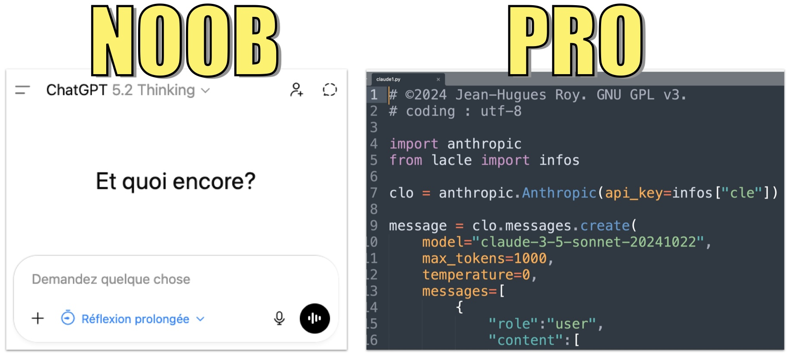

# 07. IA générative 1

## 26 février 2026

<figure><figcaption></figcaption></figure>

On peut utiliser les interfaces web des outils d'IA générative.

Mais on peut les utiliser programmatiquement au moyen de leurs API en se servant de python!

On va discuter ensemble de manières de le faire. Quelques exemples [ici](https://generative-ai-newsroom.com/) et [ici](https://arxiv.org/html/2503.16011v1).

Puis on va faire des essais avec des clés de l'API d'OpenAI que j'ai générées pour chacune et chacun d'entre vous.
