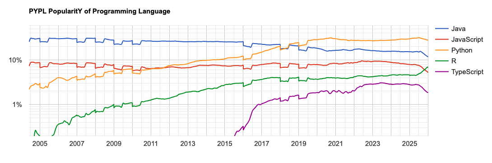

---
metaLinks:
  alternates:
    - https://app.gitbook.com/s/BxN1F1nhGZEAcZR0HuGO/intro/methode
---

# ✨ Méthode

Le contenu de ce cours colle davantage à ce qu'on appelle, dans le monde anglo-saxon, du [_Computational journalism_](https://www.datajconf.com). Il s'agit de l'application de l'informatique au journalisme.

Même le plan de cours que vous consultez en ce moment est un exemple de ce qu'on peut faire avec ces technologies. Il repose sur un système appelé [_git_](https://fr.wikipedia.org/wiki/Git), qui permet de collaborer à plusieurs sur un même projet et de voir les différentes versions d'un même fichier (pour voir comment ce plan de cours a évolué, consultez [ce répertoire sur le compte Github du programme](https://github.com/Journalisme-UQAM/edm4466_h2026)).

Mais ce qu'on fera, surtout, c'est d'apprendre la **programmation** et ses applications journalistiques.

<figure><figcaption></figcaption></figure>

## Un langage commun

Le langage qu'on utilisera s'appelle [**Python**](https://www.python.org/). C'est un langage d'usage général qui est l'un des plus utilisés dans le monde. C'est celui qui, pour les prochaines années à tout le moins, me paraît le plus utile pour vous comme journalistes et comme citoyennes. **JavaScript** (et son petit frère **TypeScript**) sont également très populaires. Mais ils sont difficiles à appréhender pour des gens qui n'ont jamais programmé. Le langage **R** est en vogue par mes collègues en sciences humaines et sociales, mais en dehors des cercles académiques, il demeure peu usité.

Le rang de chaque langage change selon la source qu'on consulte.

<figure><figcaption>
Les 10 langages les plus utilisés par les projets hébergés sur le site de codage collaboratif Github. Source: <a href="https://github.blog/news-insights/octoverse/octoverse-a-new-developer-joins-github-every-second-as-ai-leads-typescript-to-1/">Octoverse</a> (28 octobre 2025).
</figcaption></figure>

<figure><figcaption>
PyPL («PopularitY of Programming Languages) fait un palmarès en fonction du nombre de recherches dans Google pour différents langages de programmation. Le graphique montre l'évolution de quatre langages dont j'ai parlé, plus de Java, qui a dominé jusqu'à la pandémie. Source: <a href="https://pypl.github.io/PYPL.html">PyPL</a> (janvier 2026).
</figcaption></figure>

Python a ses avantages et ses inconvénients, comme tous les langages informatiques. C'est celui que j'ai choisi, car il est devenu la _lingua franca_ dans l'univers de l'« intelligence artificielle » et de la science des données. C'est aussi un langage que comprendront les informaticiennes que vous croiserez peut-être dans les rédactions où vous travaillerez.

J'ai travaillé à _La Presse_ avec des stagiaires n'étudiant pas en journalisme et qui programmaient. L'un programmait avec R, l'autre avec Python.

Enfin, son grand nombre d'utilisatrices fait en sorte que vous pourrez compter sur une grande communauté pour répondre aux questions que vous poserez certainement en ligne au cours de la session.

Plus concrètement, on s'en servira pour :

* **analyser** des données lorsqu'elles sont trop volumineuses pour un tableur comme _Excel_ ou _Calc_ de LibreOffice;
* **moissonner** des données, ou faire du _data scraping_;
* **extraire du sens** de grands volumes de texte à l'aide du **traitement du langage naturel** (ou _Natural Language Processing \[NLP]_);
* **explorer** l'utilisation programmatique d'outils d'intelligence artificielle générative.

## Une plateforme commune

<figure><figcaption></figcaption></figure>

On va faire cet apprentissage de la programmation au moyen de [Google Colaboratory](https://colab.research.google.com), ou [**Colab**](https://colab.research.google.com). Pour ce faire, il faut que vous disposiez d'un compte Google (si vous vous servez déjà de Gmail et/ou de Google Drive, tout va bien).

Je ne suis pas un _cheerleader_ des GAFA. Mais si j'ai opté pour Colab, c'est après avoir jonglé avec plusieurs autres options au cours des sessions précédentes.

Principal avantage? L'**œcuménisme numérique**. Ce service devrait donc fonctionner, quel que soit l'ordi que vous possédez : Mac, Windows, Linux, ChromeBook... Je l'ai même testé sur un téléphone dans l'application Chrome. Et ça marche :scream: !! Pas très pratique cependant...

Il permet de programmer à l'intérieur de ce qu'on appelle des **carnets**, ou _**notebooks**_, en anglais. Vous me rendrez d'ailleurs vos devoirs sous la forme de carnets.

Lorsque ce sera nécessaire, je partagerai au préalable avec vous des fichiers qui seront utiles dans le cadre des exercices en classe dans [ce répertoire partagé sur Google Drive](https://drive.google.com/drive/folders/1Ffru3XRL3EUlfc4wHKPp-EfQQSVqBiRG). Plus de détails [dans deux chapitres](https://journalisme-uqam.gitbook.io/edm4466-hiver-2026/intro/repertoire-google-drive).

### Ce cours est un échange

Je reste ouvert à vos [**demandes spéciales**](https://vimeo.com/jhroy/dj). Vous avez entendu parler d'un projet, d'un reportage retentissant, d'une technologie, d'une application particulière en journalisme? Si je puis vous aider à l'appréhender, voire la réaliser, je vais tâcher de le faire. La meilleure façon d'apprendre est avec un projet concret.

Par exemple, nous n'abordons pas [**QGIS**](https://qgis.org/), un outil d'analyse géospatiale dont je m'étais servi dans [ce dossier sur des zones d'exclusion autour des écoles](https://www.lapresse.ca/actualites/ou-installer-les-refuges-pour-sans-abri/2024-10-28/zones-d-exclusion-autour-des-ecoles/les-limites-de-la-mesure-ontarienne.php).

Inversement, si vous connaissez une technique, un outil, un truc, n'hésitez jamais à le **partager** avec l'ensemble du groupe. Parlez-m'en au préalable et on pourra prévoir une période dans le prochain cours pour que vous puissiez nous le ou la présenter. Si vous pouvez vous aussi m'apprendre quelque chose, je serai le prof le plus heureux du monde.

> #### _Il n'y a aucune honte à admettre qu'on ignore quelque chose. La seule honte est de prétendre avoir réponse à tout._
>
> – Neil deGrasse Tyson

