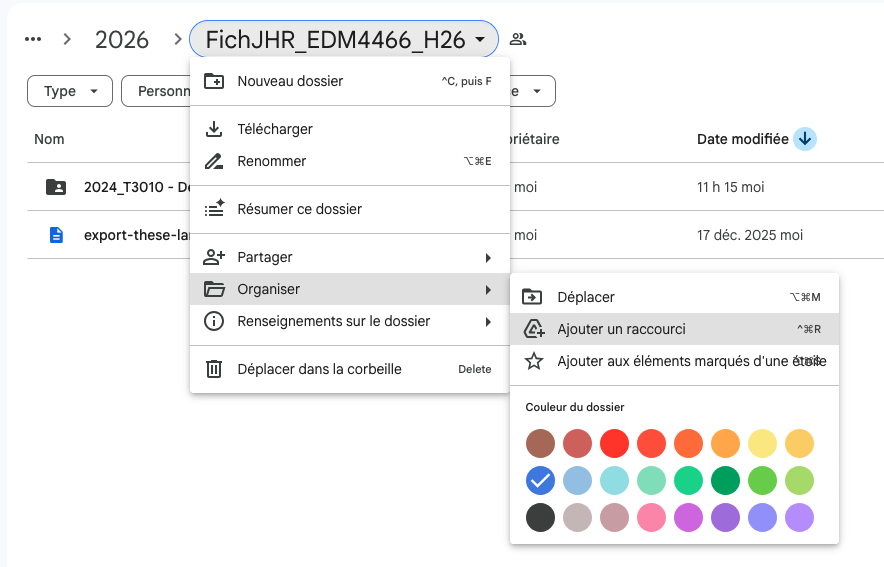
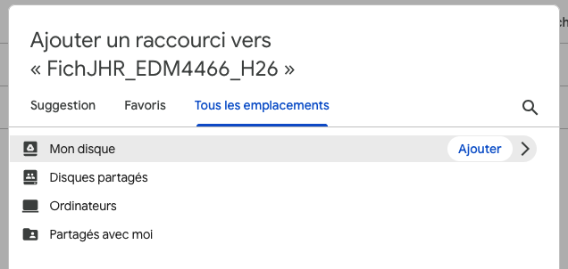
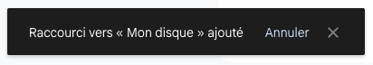
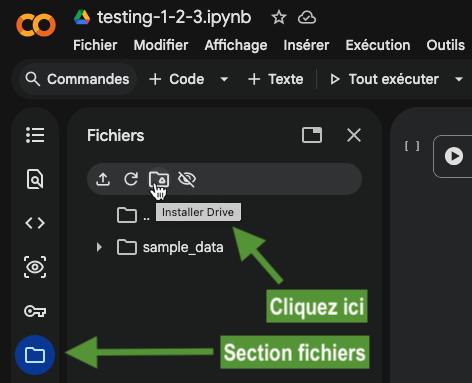
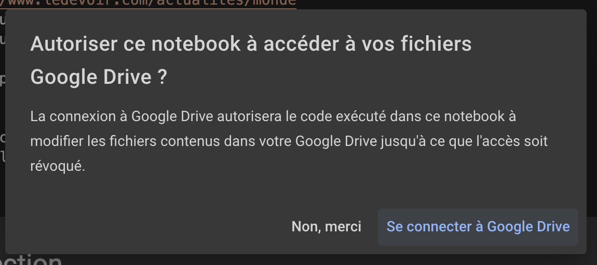
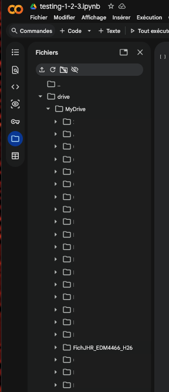

---
metaLinks:
  alternates:
    - >-
      https://app.gitbook.com/s/BxN1F1nhGZEAcZR0HuGO/intro/repertoire-google-drive
---

# 🗃️ Répertoire Google Drive

Dans certains cours, on travaillera à partir de fichiers que je rendrai au préalable disponibles ici plutôt que de vous les envoyer par courriel ou par 🕊️ voyageur. En voici l'adresse :

#### [https://bit.ly/fichiersDrive2026](https://bit.ly/fichiersDrive2026)

Pour pourvoir utiliser dans vos carnets Colab les fichiers qui s'y trouveront, voici la façon de faire.

Après avoir accédé à ce dossier,&#x20;

#### créez un _raccourci_ vers votre Google Drive

<figure><figcaption>
Étape 1
</figcaption></figure>

Puis ajoutez ce raccourci dans la racine de votre Drive.

<figure><figcaption>
Étape 2
</figcaption></figure>

Si vous voyez le message ci-dessous:

<figure><figcaption></figcaption></figure>

Succès! :partying\_face:

#### Autorisez Colab à accéder à Drive

Une fois ce raccourci créé, dans [Colab](https://colab.research.google.com), vous aurez à autoriser Colab à accéder à votre Drive.

<figure><figcaption>
Après avoir ouvert un premier carnet dans Colab, rendez-vous dans la section Fichiers, puis cliquez sur l'icône du Drive de Google
</figcaption></figure>

<figure><figcaption>
Connectez-vous. Oui, vous le voulez.
</figcaption></figure>

#### Le répertoire devrait être accessible

Une fois cette autorisation effectuée, il faudra peut-être patienter un brin :hourglass\_flowing\_sand:...

Mais vous devriez voir le dossier appelé **« FichJHR\_EDM4466\_H2024 »** dans la section _Fichiers_, répertoire _drive > MyDrive_, ou plus précisément _**content > drive > MyDrive**._

<figure><figcaption>
Et voilà!
</figcaption></figure>
