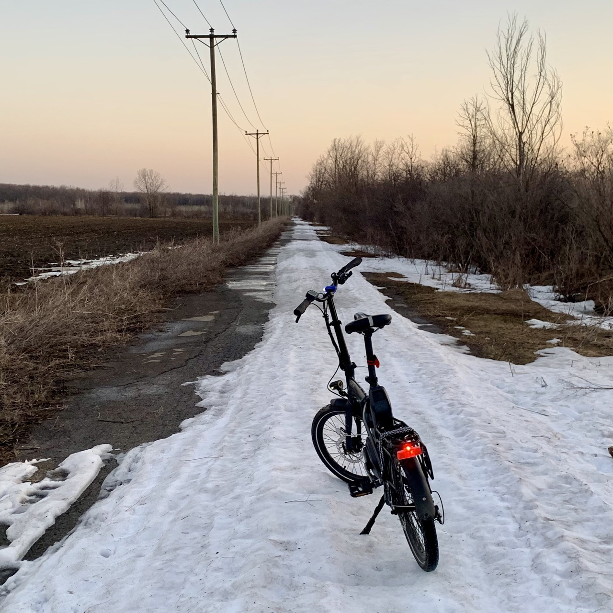

---
metaLinks:
  alternates:
    - https://app.gitbook.com/s/BxN1F1nhGZEAcZR0HuGO/travaux/travaux
---

# 🛠️ Travaux

Les travaux à remettre ont été mentionnés brièvement dans les pages précédentes. Je vous donne, ci-dessous, un peu plus de détails sur chacun de ces éléments d'évaluation.

Liens directs vers les devoirs:

* [Markdown](travaux.md#md)
* [Devoir 1](travaux.md#devoir-1)
* [Devoir 2](travaux.md#devoir-2)
* [Identifier un site web](travaux.md#site)
* [Moissonage](travaux.md#moisson)
* [Devoir TAL](travaux.md#devoir-3)
* [Travail pratique pandas](travaux.md#devoir-4)
* [Tutorat](travaux.md#tutorat-5-points)
* [Travail final](travaux.md#projet-final-25-points)

### Markdown - Exercice en classe (5 points) <a href="#md" id="md"></a>

Il suffit d'exporter votre carnet dans lequel vous avez rédigé du markdown en classe et de le déposer dans Moodle.

Tombée : 12h30 à la fin de la séance 02.

### Devoir 1 - Bixi (10 points) <a href="#devoir-1" id="devoir-1"></a>

<figure><figcaption><p>Ceci n'est pas un Bixi</p></figcaption></figure>

Dans le répertoire Google Drive du cours, vous trouverez deux fichiers contenant des données sur le service [Bixi](https://bixi.com/fr/):

* **stations\_etat.py**
* **stations\_information.py**

Le premier contient une variable appelée `etats` qui est un dictionnaire avec des données sur l'état des stations du réseau Bixi à un moment précis, cette semaine. L'état des stations, c'est notamment le nombre de bixis disponibles ou le nombre d'emplacements libres dans chaque station à ce moment.

Le second contient une variable appelée `infos` qui est également un dictionnaire avec des informations de base sur chaque station, notamment son nom et ses coordonnées.

Dans un carnet, lisez ces deux fichiers et créez, pour chaque station, une liste à laquelle vous donnerez un nom de votre choix et qui contiendra les éléments suivants:

* Le numéro de la station (son numéro d'identification ou «_id_»)
* Le nombre de vélos réguliers disponibles à cette station (les vélos électriques ne circulent pas l'hiver)
* Le nombre d'emplacements disponibles à cette station
* Le nom de cette station
* La latitude à laquelle cette station est située
* La longitude à laquelle cette station est située

Affichez (en utilisant la fonction `print()`) le contenu de votre liste à chaque itération de la boucle que vous allez créer.

À la fin de la boucle, affichez dans une phrase complète (en utilisant toujours la fonction `print()`) la somme des stations, des vélos disponibles et des emplacements disponibles qui se trouvaient sur le réseau Bixi au moment où je suis allé chercher les données.

N'oubliez pas d'ajouter des commentaires dans des cellules de texte pour m'expliquer ce que fait votre code 😀.

**INDICE 1** : Il est possible d'imbriquer une boucle dans une autre boucle.

**INDICE 2** : `infos["data"]["stations"]` et `etats["data"]["stations"]` sont des listes.

Quand vous avez terminé, téléchargez votre carnet en **format .ipynb** sur votre ordinateur.

Remettez votre carnet (**devoir1.ipynb**) dans Moodle

Tombée : 23h59, le lundi 29 janvier 2024.

### Devoir 2 - Bixi _live_ (10 points) <a href="#devoir-2" id="devoir-2"></a>

J'ai décidé de vous simplifier la tâche.

Il s'agit pour vous de répéter le devoir 1, mais cette fois de le faire en vous connectant à l'API _live_ de Bixi.

* L'état des stations est accessible ici : [https://gbfs.velobixi.com/gbfs/fr/station\_status.json](https://gbfs.velobixi.com/gbfs/fr/station_status.json)
* Les informations de base sur les stations le sont ici : [https://gbfs.velobixi.com/gbfs/fr/station\_information.json](https://gbfs.velobixi.com/gbfs/fr/station_information.json)

Une autre différence : votre carnet devra générer un fichier CSV avec les six éléments d'information que je vous demandais de colliger dans le devoir 1.

Simple, non?

Vous me remettez votre carnet par Moodle, comme d'habitude (**devoir2.ipynb**)

Si vous avez des difficultés, n'hésitez pas à me demander de l'aide. :rotating\_light:

Tombée : 23h59, le lundi 5 février 2024.

### Le site que vous voulez moissonner (5 points) <a href="#site" id="site"></a>

Identifiez un site web qui fera l'objet de l'exercice de moissonnage en classe que nous réaliserons la semaine suivante. Donnez-m'en le nom et l'URL par Moodle.

Tombée : 23h59, le lundi 12 février 2024.

### Travail pratique de moissonage en classe (10 points) <a href="#moisson" id="moisson"></a>

Remettez dans Moodle votre carnet réalisé en classe.

Tombée : 12h30 à la fin de la séance 06.

### Devoir TAL (10 points) <a href="#devoir-3" id="devoir-3"></a>

Je me suis amusé à ramasser toutes les publications Facebook du Canada francophone depuis le blocage des nouvelles par la bien-aimée Meta. Il y en a plus d'un demi-million 😱! Elles sont toutes regroupées dans le fichier **`FB_depuis_blocage.csv`** se trouvant dans le répertoire Google Drive du cours.

J'ai regroupé [dans cette liste](https://docs.google.com/spreadsheets/d/1-t5e54T-xFr5XR9nNHZWRZJiZgUyiDJyHwQ5HgC_jb8/edit?usp=sharing) les 250 pages Facebook ayant publié le plus de matériel au cours de cette période. **Choisissez une page en inscrivant votre nom à côté**.

Rédigez ensuite un carnet qui trouve les 100 lemmes (en minuscules) les plus souvent utilisés dans la colonne **`Message`** par la page que vous avez choisie. Prenez soin de bien nettoyer le texte.

Pour vous aider, chaque publication Facebook (chaque ligne du fichier **`FB_depuis_blocage.csv`**) contient 36 éléments. Les voici :

```
['Nom de page',
 'Pseudo',
 'fbID',
 'Catégorie',
 'Pays',
 'Description',
 'Date de création de la page',
 'Likes de la page',
 'Followers de la page',
 'Date/heure de création du post',
 'Date de création du post',
 'Heure de création du post',
 'Type',
 'Interactions',
 'Likes',
 'Commentaires',
 'Partages',
 'Love',
 'Wow',
 'Haha',
 'Tristesse',
 'Colère',
 'Solidarité',
 'Statut de partage vidéo',
 'Proprio de la vidéo?',
 'Vues du post',
 'Vues totales',
 'Vues Crossposts',
 'Durée',
 'URL',
 'Message',
 'Lien',
 'Lien final',
 "Texte de l'image",
 'Texte du lien',
 'Description']
```

Téléchargez votre carnet (**tal.ipynb**) sur votre ordi et remettez-le-me-le dans Moodle.

Tombée : 23h59, le lundi 11 mars 2024.

### Travail pratique pandas (5 points) <a href="#devoir-4" id="devoir-4"></a>

On réalise un travail pratique avec des données du Registre des entreprises.

Vous me remettez simplement dans Moodle un fichier CSV correspondant à un catégorie d'entreprises que vous avez choisie (**\<votre fichier>.csv**).

Tombée : 12h30, le jeudi 21 mars 2024.

### Tutorat (5 points)

Vous devez réserver au moins une séance de tutorat avec moi pour que je puisse vous aider à réaliser votre travail final.

### Projet final (25 points)

Pour votre projet final, qui est un travail **individuel**, vous avez deux options. Vous pouvez faire :

* un <mark style="background-color:blue;">**reportage**</mark> ou
* un <mark style="background-color:green;">**outil**</mark>

Si vous choisissez l'\*\*option \*\*<mark style="background-color:blue;">**reportage**</mark>, vous pouvez le faire sur un **sujet** de votre choix (conditionnel à mon approbation). Vous avez aussi le choix de la **forme** de ce reportage : il peut s'agir d'un article (de 3 000 à 10 000 caractères), d'un reportage radio (entre 3 et 10 minutes), d'un reportage télé (entre 3 et 10 minutes) ou d'un reportage web (jusqu'à 10 000 caractères également).

La production de ce reportage ou de cet outil devra impliquer de la programmation en Python pour moissonner et/ou traiter et/ou visualiser des données.

Votre reportage devra également comprendre **au moins une entrevue** avec une personne experte ou témoin, ou toute autre personne intervenante en mesure de valider ou d'incarner ce que racontent les données dans votre reportage.

L'\*\*option \*\*<mark style="background-color:green;">**outil**</mark> peut prendre diverses formes. Il peut s'agir d'un robot Instagram, d'un outil qui automatise des tâches fastidieuses dans une salle de presse, etc. Si vous vous êtes déjà dit : « Hé! Ce serait cool si on pouvait faire telle chose! » Eh bien, allez-y! Faites-la! _W kapab_!

### _Making-of_ (10 points)

Quelle que soit la forme que prendra votre travail final, il devra être accompagné d'un texte **(en format PDF)** qui :

* compte entre 3 000 et 5 000 caractères;
* comprend des liens vers **toutes** les sources de documentation qui vous ont aidées en cours de route;
* comprend des hyperliens vers **toutes** les sources de vos données et/ou carnets que vous avez utilisés (s'il y a lieu);
* décrit votre démarche :
  * Pourquoi ce sujet?
  * Quels outils ou quelles technologies avez-vous utilisés?
  * Pourquoi les avoir choisi(e)s?
  * Comment vous ont-ils(elles) servi?
  * Quels problèmes avez-vous éprouvés (s'il y a lieu).

Votre document PDF doit être accompagné, s'il y a lieu, de tous les carnets que vous avez écrits, et/ou de tous les autres fichiers pertinents **(.py, .csv, .ods, .xls, .sql ou autres)** que vous avez récoltés ou dont vous vous êtes servis.

Vous mettez tout cela dans Moudeul avant le début du dernier cours (9h30, le 18 avril 2024) _por favor_.
